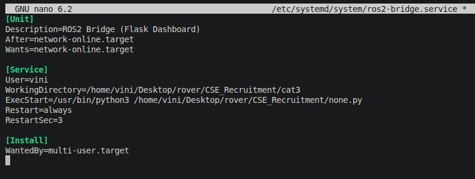

# Category 3
## Task 3.1

Before we staert off with the implementation, herer's a glossary of tech stuff I explored through this task:
1. systemd service 
    - when I read [this documentation](https://documentation.suse.com/smart/systems-management/html/systemd-basics/index.html) I pretty much understood it.
    - But, I couldn't quite figure out the differences of systemd and cron and I found this [answer](https://unix.stackexchange.com/questions/278564/cron-vs-systemd-timers?)
    - moving on to daemon processes which essentially were processes that run independent of any user control, are task specific and are run in the background.
2. Telemetry
    - [This](https://github.com/bomonike/telemetry) was a small deviation I took, and made me slightly curious on the exact [working of telemetry streams](https://docs.formant.io/docs/how-telemetry-streams-work)


The scenario includes:
1. ros2 Bridge Service
    - after I implemeted this service, i realized that this wasn't really a ROS2 to Gazebo bridge but a bridge between a simulated telemetry and the operator dashboarrd. Ideally it musn't be the latter.
2. The telemetry service 


The approximate flow: 
```python
    Booting > (system boot - systemd - network-online.target(a gate to check if the network is really up)) >> Service Dependencies > (ros2 bridge service - telemetry-logger service) -- ready.
```


## Task 3.2

- While doing this task, I realized this was effectively a Chaos Engineering task.

1. First, I could simply change the service config, that would "break" the system.



And as expected, it fails to get activated.
```python
vini@vini-LOQ-15ARP9:~/Desktop/rover/CSE_Recruitment/cat3$ systemctl status ros2-bridge.service
● ros2-bridge.service - ROS2 Bridge (Flask Dashboard)
     Loaded: loaded (/etc/systemd/system/ros2-bridge.service; enabled; vendor preset: enabled)
     Active: activating (auto-restart) (Result: exit-code) since Thu 2026-04-09 20:40:10 IST; 752ms ago
    Process: 33011 ExecStart=/usr/bin/python3 /home/vini/Desktop/rover/CSE_Recruitment/none.py (code=exited, status=2)
   Main PID: 33011 (code=exited, status=2)
        CPU: 19ms
```


2. I could mess with the permissions using chmod, not give any r-w-x permissions(initialize it all to 0)
```python 
vini@vini-LOQ-15ARP9:~/Desktop/rover/CSE_Recruitment/cat3$ sudo chmod 000 logger.py
vini@vini-LOQ-15ARP9:~/Desktop/rover/CSE_Recruitment/cat3$ sudo chmod 000 app.py
vini@vini-LOQ-15ARP9:~/Desktop/rover/CSE_Recruitment/cat3$ sudo systemctl restart ros2-bridge.service
vini@vini-LOQ-15ARP9:~/Desktop/rover/CSE_Recruitment/cat3$ sudo systemctl restart telemetry-logger.service
vini@vini-LOQ-15ARP9:~/Desktop/rover/CSE_Recruitment/cat3$ systemctl status ros2-bridge.service
● ros2-bridge.service - ROS2 Bridge (Flask Dashboard)
     Loaded: loaded (/etc/systemd/system/ros2-bridge.service; enabled; vendor preset: enabled)
     Active: activating (auto-restart) (Result: exit-code) since Thu 2026-04-09 20:48:19 IST; 373ms ago
    Process: 34421 ExecStart=/usr/bin/python3 /home/vini/Desktop/rover/CSE_Recruitment/cat3/app.py (code=exited, status=2)
   Main PID: 34421 (code=exited, status=2)
        CPU: 20ms
vini@vini-LOQ-15ARP9:~/Desktop/rover/CSE_Recruitment/cat3$ 
```

3. A dependency loop


adding a ``` Requires ``` condition in both the files surely crashes it by making it mandatory for one file to start first for another, hence going into an infinite loop.

4. Lastly, here's my chat of shame https://chatgpt.com/share/69d7ca2e-59e0-83a7-96c9-7dad4b41d019 
but llms apart, i started from here: https://unix.stackexchange.com/questions/15348/writing-basic-systemd-service-files

