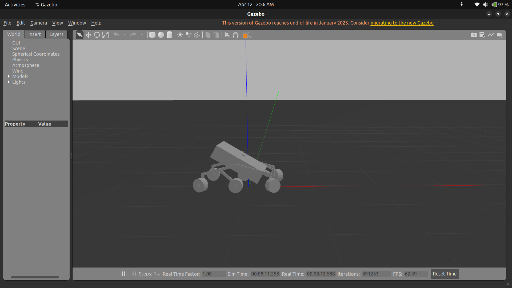
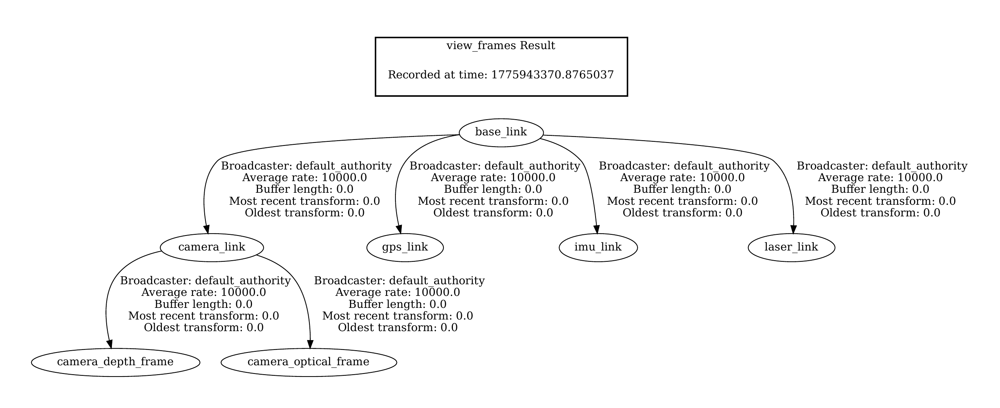
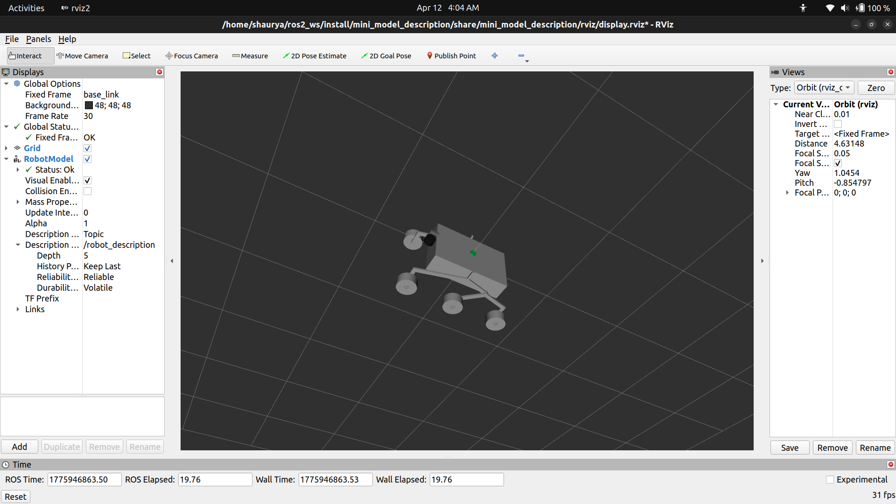

# mini_model_description

ROS 2 package for the mini rover (Category 2 submission)

### Gazebo Simulation
Got the rover spawning in Gazebo Classic (v11) using a launch file. Took a while
to get the meshes and urdf showing up correctly since the install paths kept
breaking. The rover shows up with all 6 wheels and the suspension links. There's
a tilt issue on spawn that I couldn't fully fix prolly something to do with how the
URDF axes are set up vs how Gazebo expects them. The joints and wheels are working
though.

### Differential Drive Controller
Set up ros2_control with a diff drive controller. Left side is Revolute 36, 37, 38
and right side is Revolute 29, 30, 31. The controllers load automatically when you
run the bringup launch file, though I had to add delays so they don't try to start
before Gazebo is ready.

### Odometry and TF
The diff drive controller handles odom publishing and the odom → base_link transform.
Joint states go through joint_state_broadcaster → robot_state_publisher which fills
out the rest of the TF tree.

## How to Run

cd ~/ros2_ws
colcon build --packages-select mini_model_description
source install/setup.bash

# Gazebo + controllers
ros2 launch mini_model_description bringup.launch.py

# RViz (separate terminal)
ros2 launch mini_model_description display.launch.py

## What's Not Perfect
- Rover spawns slightly tilted in Gazebo, still figuring out the axis fix
- Sensor plugins (camera, lidar, gps) are in the URDF but they use Ignition
  syntax so they don't actually work in Gazebo Classic
- Had a lot of back and forth getting the package to build and install correctly

### Rover in Gazebo

### TF Tree

### Rover in RViz with TF

